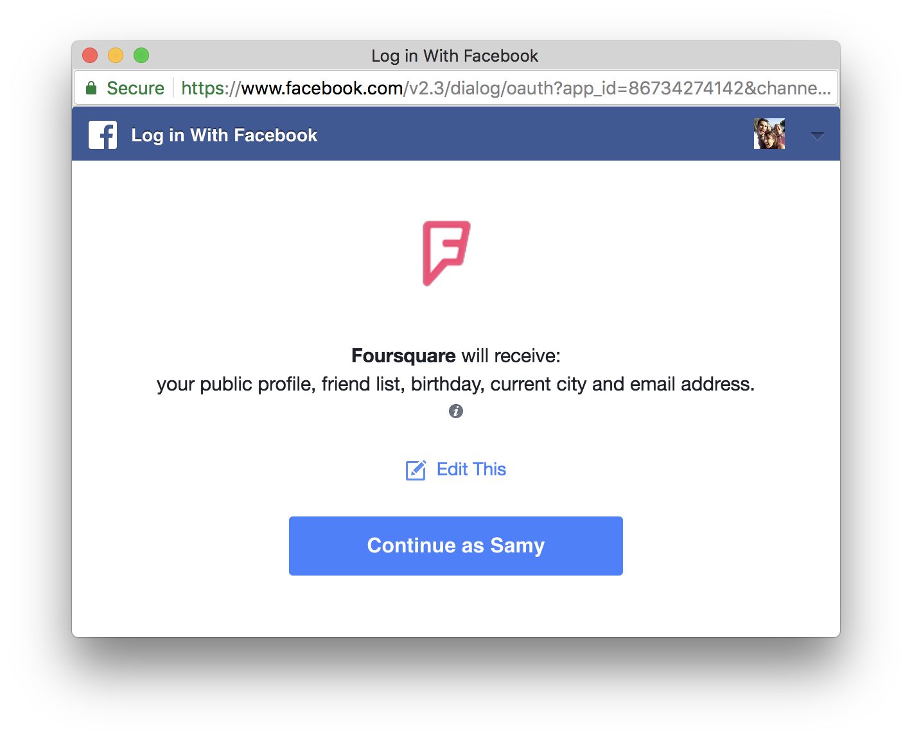

# OAuth

---

Protocol libre permettant à un sdervice d'utiliser une API au nom d'un utilisateur.

Crée par Twitter, et maintenant utilisée par la quasi-totalité des services web (Facebook, GitHub, Uber, Instagram, etc).

---

## Problème résolu:

> Je ne fais pas confiance en cette application pour partager avec eux mon mot de passe Facebook.


---


---



---

## Implémentation

1. Créer une application sur le provider (Ex pour Facebook: developers.facebook.com)
2. Obtenir le client ID et client Secret pour l'application
3. Rediriger l'utilisateur vers l'url d'authorization: `https://www.facebook.com/dialog/oauth`
4. Le service demande l'autorization à l'utilisateur
5. Le service redirige vers l'application avec un code
6. L'application échange le code contre un access token
7. L'application utilise le token pour accéder à l'API au nom de l'utilisateur


---

## 1. Créer une application sur Facebook

Vous pouvez créer une application sur https://developers.facebook.com/docs/facebook-login/manually-build-a-login-flow/, en entrant les informations:

- Nom de l'application
- Logo
- Redirect URL

---

## 2. Obtenir les identifiants de l'application

- **Client ID**: Identifiant unique de votre application sur Facebook (public)
- **Client Secret**: Clé d'identification privée de votre application sur Facebook 

---

## 3. Rediriger l'utilisateur vers l'autorisation Facebook

Lorsque l'utilisateur souhaite s'authentifier avec Facebook:

```text
https://www.facebook.com/v3.0/dialog/oauth?
  client_id={app-id}
  &redirect_uri={redirect-uri}
  &state={state-param}
```

---

## 4. Facebook demande l'autorisation à l'utilisateur

---

## 5. Facebook redirige vers l'application

```http
GET {redirect-uri}?code={code}&state={state-param}
```

---

## 6. Échanger le code contre un access token

```http
GET https://graph.facebook.com/v3.0/oauth/access_token?
   client_id={app-id}
   &redirect_uri={redirect-uri}
   &client_secret={app-secret}
   &code={code-parameter}
```

---

```js
{
  "access_token": {access-token}, 
  "token_type": {type},
  "expires_in":  {seconds-til-expiration}
}
```

---

## 7. Utiliser le token pour accéder à l'API au nom de l'utilisateur


```
GET https://graph.facebook.com/v3.0/me?
       access_token={access-token}"
```

---

Résultat:

```
{
  "name": "Samy Pessé",
  "id": "1256486429"
}
```

---


## 👨‍💻 Exercice:


Écrire un serveur qui authentifie l'utilisateur avec Facebook, pour ensuite afficher son nom.
