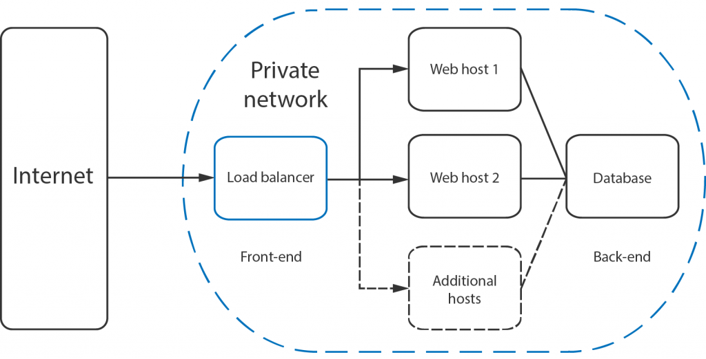

# Load Balancing

---

## Montée en charge

Que se passe t'il lorsque l'app recoit beaucoup de requetes ?

---

## Vertical scaling

> Augmenter la capacité de la machine (CPU / mémoire).

- :white_check_mark: Facile à executer
- :x: Limitation physique
- :x: Solution coûteuse

- :x: Inutile en Node.js: single-threaded et limiter à 1.7GB de mémoire

---

## Horizontal scaling

> Ajouter plus de machines au pool de resources.

- :white_check_mark: Pas de limite physique
- :white_check_mark: Peut-être combiné à du vertical scaling
- :white_check_mark: Coût directement proportionnel à l'usage
- :x: Contraintes sur l'application

---

## Load balancer / Reverse proxy

**Objectif:** Distribuer les requêtes arrivant sur un serveur vers plusieurs instances de l'application.

---

## 👨‍💻 Exercice (1h30):

https://classroom.github.com/a/dmrqfjkU

Implémenter un serveur de load balancing (**HTTP** + **Websocket**)

Module à utiliser: `ws`, `http`, ou `net`

---

## Solutions de load-balancing:

- Heroku
- AWS EC2
- Solutions open sources

---

## Conclusion

Ne reimplementez pas votre propre load-balanceur.
