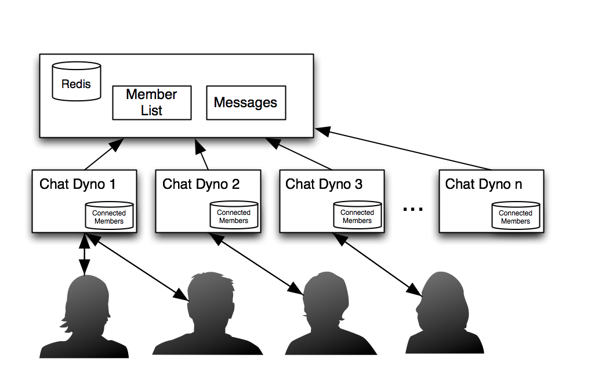

# Redis

---

## Redis, c'est quoi ?

Redis est une base de donnée key/value, qui peut-être utilisée pour du cache ou du Pub/Sub.

---

## Usages de Redis:

- Cache
- Session store
- Message broker

---

## Installer redis

Sur mac:

```
$ brew install redis-server
```

Lancer le serveur redis:

```
$ redis-server
```

Installer le client Node:

```
$ npm install redis
```

---

:warning: Par defaut, Redis est une base de données in-memory!

---

## Utiliser Redis comme un cache:

```js
const redis = require("redis");
const { promisify } = require('util');

const client = redis.createClient();

const set = promisify(client.set).bind(client);
const get = promisify(client.set).bind(client);
```

et:

```js
await set("a key", "some value");
const value = await get("a key");
```

---

## Redis Pub/Sub

- **Subscriber**: Écoute les messages postés sur une channel
- **Publisher**: Push des messages sur une channel

---

## Publisher

```js
const redis = require("redis");
const publisher = redis.createClient();

publisher.publish("a nice channel", "A message.");
```

---

## Subscriber

```js
const redis = require("redis");
const subscriber = redis.createClient();

subscriber.on("message", (channel, message) => {
    console.log(message)
});
subscriber.subscribe("a nice channel");
```

---

## 👨‍💻 Exercice

https://classroom.github.com/a/vrv0Z_Cn

Utiliser Redis comme message broker pour broadcast les messages vers tous les clients websockets des différentes instances.

---



---

## 👨‍💻 Exercice

Utiliser Redis pour stoquer l'êtat des différents dessins (par channel).
